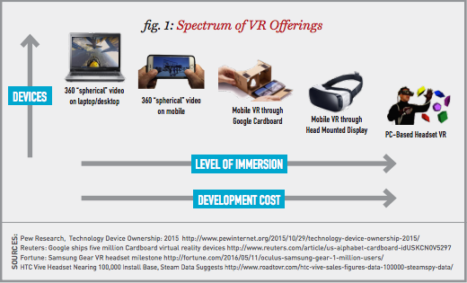
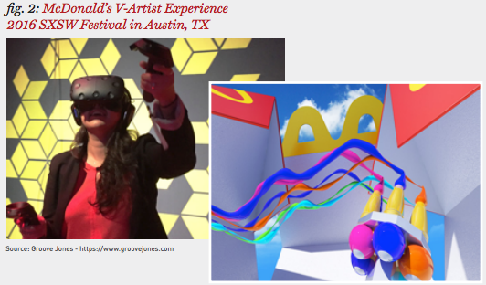
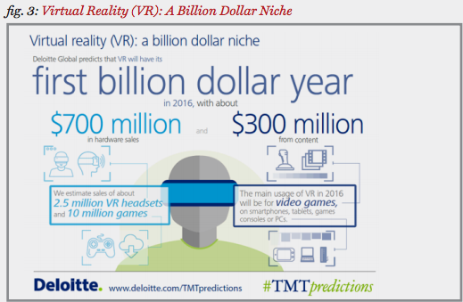
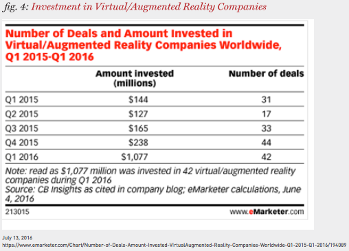
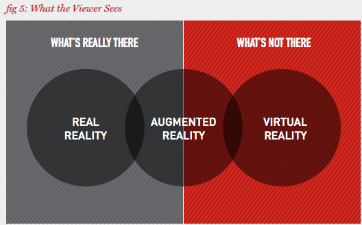
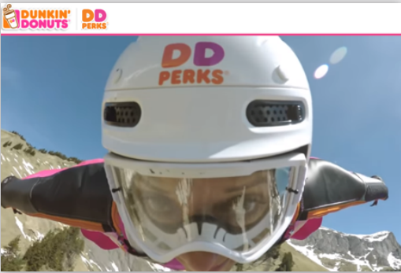
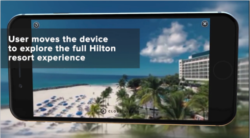
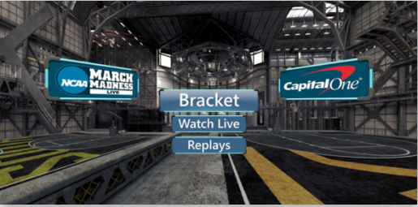

[原文](http://www.iab.com/wp-content/uploads/2016/09/IAB_VR_Report-Sep-2016.pdf)

## Introduction
Everyone has their “first time experience with Virtual Reality” story. These first VR
experiences are often profoundly transforming, providing breakthrough glimpses into
artificial realities that were previously only present in our imaginations. We see these
first experience stories play out again and again with friends and colleagues who pick up
and try Google Cardboard at the office, or who attend events with demos of an ultra-highend
VR headset. For those in publishing, marketing, ad tech, and creative communities,
VR opens the door to exciting new opportunities for developing immersive content and
brand storytelling.

For those who have been watching the Virtual Reality space for a while—or experienced
the rise and fall of 3D Video—it’s natural to feel uncertainty about both where things are
with VR today, and where they might be heading. As it turns out, though, 2016 has already
been a historic year: we are now seeing Virtual Reality finally achieving mass scale. With
the consumer launches of Oculus Rift, HTC Vive, and Samsung Gear, VR experiences are
expanding beyond the hardcore gaming community and into everyday mobile and desktop
browsers via 360 video. Market penetration has deepened with the emergence of VR apps
and games viewed through Google Cardboard, as well as other more advanced headsets.

So in this watershed year, it’s been incredibly interesting speaking with the practitioners
of Virtual Reality—the professionals who are actively creating the VR hardware, software,
content, and advertising—to explore what they’ve learned thus far and where they see
things headed. While our conversations with industry experts focused largely on VR,
Augmented Reality (AR) was also discussed at some length—especially since the July,
2016 launch of Pokémon GO—which points to the continued evolution of enhanced mobile
experiences that overlay digital information on top of the physical world.

This report offers an overview of observations and opinions on VR from a distinguished
panel of over two dozen industry-leading voices in publishing, advertising, VR software,
and developer platforms that IAB conducted from June through August, 2016. The
findings offer a market snapshot detailing key takeaways, lessons learned, and future
plans in the emerging field of Virtual Reality.

This document is not intended to serve as a technical guide or complete VR primer; more
formal documentation on VR terminology, definitions, and emerging ad formats from
IAB are forthcoming. This overview offers a current snapshot of what the VR landscape
looks like, in the words of those working in the space. We hope that you find this overview
of industry expert opinions and observations illuminating and useful, as together we
process the unfolding implications of Virtual Reality.

## Defining Virtual Reality - Practice And Pitfalls
As we discussed VR with publishers and advertisers, we wanted to make sure that we
were all speaking the same language. Does everyone think of VR in the same way? Are
there standard definitions for what constitutes VR? The short answer for both is “no.”

In its purest form, VR contains stereoscopic video allowing each eye to view a different
display or video that—when combined with the view from the other eye—creates a
visual, virtual reality. Spatial audio—where sound has direction and volume relative to
its source—enhances that virtual experience with 3D sound. The ability to walk around
this virtual world can help to maximize the immersion effect. And the self-awareness
provided by one’s own hands and feet in a virtual world can further immerse the
participant in an alternate reality.

Perceptions on the core elements of tech, content, and user experience required for basic
VR remain a moving target. The rapid rate of change in the VR space only complicates
attempts at definition. Much like programmatic video, there is a spectrum of VR offerings—
with the fully immersive visual, auditory, and physical experience of VR on one end of the
spectrum, and 360 video on desktop on the other. Additionally, some believe that dedicated
headsets are required for true VR, and that makeshift devices that hold a smartphone
close to your face fall short of providing a truly immersive VR experience.

So where does this leave 360 video? 360 video can be consumed on any screen, with
navigation through content guided by a controller like a mouse, or the accelerometer of
a mobile device. The screen only has to be visible—whether a few feet away, or strapped
to one’s face. As Figure 1 illustrates, the quality of user immersion varies across the VR
platforms, with simpler 360 video falling short of a true VR threshold.

Ultimately, “immersiveness” is the watchword in VR for both advertisers and
publishers. Yale Cohen, SVP, Publicis Media expressed it best when he said, “When I
want to view digital video, I can be in my living room watching it on a screen. VR turns
that model upside down because you don’t know you’re in your living room. You could
be anywhere.” Noah Heller, VP, Emerging Technology at Hulu added, “You know it’s VR
when someone has a visceral reaction.” Whether that immersiveness requires spatial
audio, the ability to see your own hands in the virtual world, and the freedom to walk
around unimpeded is up for debate.

For Time Inc.’s Chris Hercik, “true VR” is more of an immersive experience that
enables the user to interact in some way with the content, and choose a path within an
experience. For him, 360 video or photo experiences are not necessarily VR. “I think
we need to clearly distinguish the two, because when we’re talking to advertisers or
partners, we need to clarify which one offers just a point of view and means of looking
around, and which one is more immersive.” Mia Tramz, also from Time Inc., added
that in her mind, the future of the medium is fully immersive experiences. “360 VR
experiences are great on-ramps to VR and for acquainting consumers with the medium,
but the platforms that offer more immersion and interaction—especially in room scale—
are undeniably compelling.”

As with any video striving to reach the consumer through sight, sound, and motion, let’s
not forget the importance of the content, regardless of format. Aaron Luber of Google
points out, “Whether it’s mono or stereoscopic video, we’re still trying to answer the
same questions around how do you tell a story? What did you draw peoples’ attention
to? And that has nothing to do with whether or not the content was in 3D.”

In the quest to understand publisher’s and advertiser’s definitions of VR, other terms
and acronyms surfaced including AR (Augmented Reality), MR (Mixed Reality), and IR
(Interactive Reality), which, despite their own challenging definitions, each provide
immersion to lesser degrees than VR. You may have even heard of a recent mobile game
called Pokémon GO that harnesses Augmented Reality and has drawn millions of people
across the world to chase down imaginary creatures in the real world, using their
mobile phones.

## How Are Publishers and Advertisers Creating VR Content?
Perhaps not surprising is that when we define VR as having multiple levels of
complexity, the deepest levels of immersion also cost the most to produce, while the
simpler and less complex activations—like 360 video—bring the lowest relative creation
costs. This cost disparity has also led to a disparity in VR audience scale, with 360/
spherical video (available on YouTube and Facebook) at one end having the greatest
audience scale, while stereoscopic, 3D audio, head-mounted display experiences still
face significant challenges of scale.

When The New York Times launched its NYT VR app in November, 2015 with launch
sponsors GE and Mini, it became the most successful app launch in NYT history. Since
then, advertisers have included Cadillac, Ford, Lufthansa, Hilton, and TAG Heuer.
According to The Times’s VP of Ad Innovation, Nick Van Amburg, “We reached one
million users at launch, driven in part by distribution of a million Google Cardboard
viewers to Sunday home delivery subscribers, and we also sent Cardboard to more than
300,000 of our digital subscribers. The app has had more than 950,000 downloads.” Van
Amburg says they’re now seeing users spend on average over six and a half minutes
in the NYT VR app, with 58 percent of users coming back month over month. When you
include YouTube and Facebook 360, there’s significant distribution building for The
Times’s 360 video assets as well. “We’re now talking about engaging millions of people,
which means this is not a flash in the pan—it’s something people want more of.”

Hulu is working with Live Nation to create VR experiences that are more than just a 360
camera on a stick. These videos reveal the artist’s creative process, the dressing room,
the onstage experience, audience reactions, and the show’s aftermath.

As VR grows and creators, publishers, and advertisers work to engage consumers in
relevant and meaningful ways, timing and recency become factors, just like in any form
of video. While a large portion of content for VR is pre-recorded, Fox Sports focuses
heavily on live content, working closely with NextVR to create live VR sports experiences.
More recently, Fox Sports has added interactivity to take the experience to a level beyond
360 video. In an integration with the Daytona 500, Toyota’s VR activation with Fox Sports
became a great complement to the rest of its campaign.

Turner Sports, through its partnership with Facebook’s Oculus VR platform, also has
begun live streaming its sports events—including NCAA basketball March Madness
games—via an app made available to users of Samsung’s Gear VR headset. “What better
way to give people access than to than to put them in the live game itself,” says Turner
Sport’s Mark Johnson.

The advertising content found in VR today ranges from rich, custom app-based
experiences that immerse the viewer in a piece of branded entertainment—such as
an exploration of a travel destination, or a deep dive demonstration of an automobile
interior—to simpler 360 video executions that follow existing digital video conventions,
including pre, mid, or post-roll videos presented within a larger VR video experience. 

There are also examples of deeply immersive event-based VR activations. At the 2016
South by Southwest (SXSW) conference, a number of brands were engaging in VR.
Groove Jones, a creative studio focused on Virtual Reality content and apps, created the
McDonald’s VR activation, a completely custom experience that gave consumers the
opportunity—wearing the HTC Vive VR goggles—to step into and decorate the inside of a
virtual Happy Meal box using hand-held controllers.

Publishers we spoke with agreed that agencies and advertisers have been very
interested and active in pursuing VR and 360 video opportunities, often as components
of larger digital campaigns. The challenge for sellers is simultaneously qualifying and
educating buyers on what’s actually possible—while it’s being invented. 

VR has created a new way for publishers and advertisers to work together creatively.
Instead of delivering traditional video content to the publisher, agency creatives are
increasingly asking publishers for ideas and creative executions. This in turn pushes
more publisher branded content teams into VR, either partnering with VR production
studios, or building dedicated in-house teams. The more complex the idea, the more
tailored the solution. 

## What are VR's Streangth and Opportunities?
### IMMERSIVE STORYTELLING
When we spoke to publishers and advertisers about the opportunity and promise of VR,
invariably our experts used terms such as “immersion,” “presence,” and “empathy” to
highlight the difference in storytelling capabilities that VR brings. For DigitasLBi’s Megan
McCurry, the medium’s strength comes from its immersive properties and the opportunity
for advertisers to focus the consumer’s attention in an entirely new way. “We all know how
    hard it is to capture someone’s attention and do it well with traditional media forms. VR
    offers a novel way to engage with people on a much more immersive basis.” 

Marketers know—perhaps better than anyone—how distracted consumers are as
they’re looking at multiple devices throughout the day. So how does one cut through the
clutter and gain some advantage? One of the most important things VR has going for
it is that it really does create focus. Viewers are totally immersed in the experience—
whether it’s through a mobile device viewed through cardboard or a more advanced
headset, people are totally focused on the message. For sports and entertainment
firms like Live Nation, Fox Entertainment, and Turner Sports, capturing and streaming
live events in VR represents a compelling new way to develop audiences remotely, by
offering VR consumers the best seats in the house. With VR, the content publisher can
bring the fan closer to an artist than they ever could be in real life.

Time Inc.’s Chris Hercik sees VR changing the way they build content across the entire
portfolio of Time Inc. titles, from People to LIFE magazine. “We talk about storytelling
and bringing a viewer into an experience. VR is the most powerful way to put a user into
the story. Whether it’s practicing mindfulness in a bioluminescent forest, experiencing
a long-form documentary, floating in outer space, driving a car 200 miles an hour, or
experiencing an immersive VR fashion and music video. There is nothing as immersive
as this. I think it’s going to prove to be a very powerful tool.”

### SHOPPING AND PRODUCT DEMOS 
In terms of monetization opportunities, many among our expert panel mentioned the
impact they expect VR will bring to the worlds of shopping, real estate, and product
demos. Citing a recent Fast Company article and earlier Journal of Consumer
Research study, one expert mentioned that consumers who go into a store and
touch an item may be willing to pay more for the item than those who didn’t touch
it, and that this also holds true for those who were asked to simply imagine they’d
touched the product. The study’s findings are interesting to consider in the context
of VR’s ability to create brand impressions through immersion. With Virtual Reality,
consumers not only imagine, but actually have the experience of touching and
checking out merchandise, which may impact their purchase intent and potentially
their overall affinity for a brand.

### ABILITY TO STIR EMOTIONS
A number of the experts we surveyed spoke about the power of VR to stir emotions
and create empathy among viewers in an entirely new way, particularly with VR
stories that place the viewer in the center of a situation that they might not otherwise
experience. Being at the top of Mount Everest, or experiencing war as it happens, or
being transported to the middle of a natural disaster are all experiences that bring deep
emotions to the surface, something that publishers and journalists have always sought
to arouse in their audiences.

One expert described the emotion-grabbing aspect of VR, as they remembered watching
The New York Times’ award-winning VR documentary “The Displaced,” about a group of
children who lost their homes and families to war. “As I was watching, I heard a plane
overhead and it became louder, and I saw food drops happening. And you could see, as
the food fell to the ground, people came running out to grab it. This was one of the most
powerful things because it brings all your senses to life. I think VR is one of the most
potent empathy engines. When you’re actually feeling like you’re there, you gain a whole
new level of empathy for a subject.”

While VR today is for the most part a solitary media experience, there are applications
for promotional and out-of-home events that gather people together to experience VR
content. Marley Kaplan, Head of Innovation at Kinetic, explains: “The same way people
engage while watching sporting events at bars or dive into adventures through movie
screens or theaters, Virtual Reality provides a realm of new experiences that people
ultimately bond over together. Essentially, VR has the power to connect the one-toone
experience with the one-to-many. When a VR activation is presented in a space for
shared experiences—like amusement parks or industry events like South by Southwest—
brands can connect with audiences on an emotional level for a more engaging
experience than ever before.”

### CONTENT PRODUCTION: THINKING OUTSIDE THE FRAME
VR enables the viewer to control what they see as they move their head or their virtual
bodies (avatars) through space, essentially turning the viewer into the storyteller. For
many of the experts we spoke with, understanding this fundamental shift in control is
crucial for successfully leveraging the platform. This paradigm shift is having a profound
impact on the production of VR content and advertising.

When one produces traditional video or a commercial, the process is pretty
straightforward. There’s a camera, actors, and a director, and that’s about it. But in VR,
multi-lensed cameras are pointed everywhere. Producers need to think about all the
various ways that someone might engage in the experience and try and figure out, in
advance, potential storylines from multiple end-user perspectives. VR directors need to
consider all the different people on a set, the actors, and the production staff who now—
because the camera sees everything—may also be in the shot. Future VR directors may
need to think less about how to control the viewer’s experience, and more about how
to highlight viewing options with multiple camera angles and on-screen cues that help
guide viewers through their own self-directed storyline.

VR may also put greater demands on video editors and game developers, whose jobs
will require an understanding of what audiences need in terms of visual or auditory
cues, and giving it to them before they have to search for it. The ability to edit VR video
in a way that anticipates and subtly leads users through their self-directed experience—
while also providing a coherent narrative—will require new models for thinking about
    audience perspective and engagement with content.

## VR Weakness and Threats
As of this writing, VR is still a niche offering, though a growing one with tremendous
potential. While VR technology is improving and hardware is becoming cheaper and
easier to access, our experts expressed genuine concerns, especially with the current
rate of adoption, and the challenges that a lack of audience scale brings to monetization.
As DigitasLBi’s Megan McCurry explains: “Once you get someone to engage, that’s
great, but it takes quite a lot at this point to get them to take time to watch the video and
engage with these experiences.”

### CONSUMER ADOPTION AND SCALE
Opinions varied in terms of speed of adoption and barriers to growth. Some wondered if
VR can catch up to the numbers that industry analysts have anticipated for VR. Deloitte
Global, for instance, has predicted that 2016 will be the first billion dollar year for VR, 
with $700 million in hardware sales and the remainder coming from content. In terms of
headsets, Deloitte Global estimates that 2.5 million VR headsets and 10 million copies of
VR games will be sold in 2016.

The key issues at this point are making sure that the technology is broadly distributed—
beyond the gaming community—and that the pipeline for content is fast-flowing.

For National Geographic’s Jim Kelleher, a concern is the pace of adoption of higherend
systems to move the market beyond lower-end 360 video experiences, otherwise
“the immersive experience could remain a niche, heavy gamer experience in the
near term.” 

### HIGH COST
The high cost of VR represents another threat to growth. Currently, the target market
for PC-based high-end systems—like Oculus Rift and HTC Vive—is the hardcore
gamer that’s willing to spend over a thousand dollars to experience fully-immersive
VR. The question many of our experts raised around costs is whether smartphonebased
VR can evolve to become more competitive with PC-based experiences
that require much more powerful hardware, software, and a faster internet
connection. For Immersv CEO Mihir Shah, there is an opportunity through lowercost
smartphone-based experiences to grow the audience for VR far beyond the
gamer community. “We expect the VR experience on smartphones to become a core
function, not just… ‘OK, it works with the headsets’.” 

### FIRST IMPRESSIONS ARE CRITICAL
Given the extraordinary level of hype surrounding VR, consumers understandably come to
VR expecting to be “wowed.” And while it’s possible they will be dazzled by the experience,
there’s an equal chance for them to have an underwhelming, or worse, nauseating
experience. Negative first impressions could confirm any existing skepticism. Consumers
who have negative experiences now—at this early stage of the medium—may walk away
from VR, potentially for years.

The nausea problem is itself an indication of how early-stage we are in in terms of the
maturity of VR hardware and software. What causes nausea for some users of VR? If your
visual sense perceives that you are in motion, but your ears and other sensory systems
perceive that you are stationary, this creates a conflict, a cognitive disconnect that can
result in a feeling of motion sickness. This problem appears to be less of an issue with
higher performance systems that can render VR video at a higher frame rate. According
to one expert, “When you have good hardware and software, that helps, but it also
depends on the storytelling. Content developers also need to be mindful of what to avoid
experience-wise, to reduce the chance of nausea.”

When considering the current technical issues and challenges surrounding VR, one would
have to include things like resolution quality, clarity of images, and depending on the
hardware, issues like latency, frame rates, and how quickly one’s movements track to the
real-time progression of what’s being experienced in the headset. If that doesn’t track
closely, motion sickness can enter in.

## How is Success Measured in VR Activations?
We asked publishers and advertisers to share how success is being measured within their
own—and their client’s—VR publishing efforts.

### PUBLISHER KPIs
For some publishers, given the early stage of development in the medium, the current
focus is on learning over success through monetization. In terms of key publisher
metrics, 3D software development firm Unity offers its VR content creators an analytics
solution that enables them to check the retention of users, how many people engaged
with the content, and how many installs they’ve driven for other publishers. According
to Unity’s Agatha Bochenek, they’re also integrating flexible event tracking into an ad
metrics dashboard that will allow publishers to create custom events and segments in
order to optimize content—and in the future, ads—within the system.

VR analytics firm Retinad—which offers heat map-based analytics—sees the majority of
their publisher clients requesting insights into “where people are looking in 360 videos and
content, the main points of interest, how long people stay there.” They’re also looking to
better understand the in-app user experience, and what gives people motion sickness in a
particular experience or video sequence. “At this point it’s more about understanding the
user,” said Retinad CEO Sam Poirier. 

### ADVERTISER KPIS
In terms of VR ad metrics, AOL’s Quinn Borsuk highlighted the still-nascent state of VR
creative and campaign measurement: “This is something we need to develop. There are
no standards yet. Will we be looking at completion rates? Or getting to a place where
we are talking about attention and understanding where folks are spending their time
looking? We need to understand what immersion metrics will look like.”

VR ad tech provider Immersv calculates effective CPM and effective CPA (cost per
action or download) for their client campaigns. For them, a cost-per-view standard
seems reasonable. As Immersv CEO Mihir Shah said, “We’re able to track a wide
range of events that enable clients to do their own engagement calculations. At
the end of the day, it’s all based on a video view. We’re seeing an 81% gaze-through
rate (GTR) on our campaigns, which means the user gazed all the way through the
video. And network-wide we’re seeing a 35 percent conversion rate, which is orders
of magnitude higher than web and mobile, and speaks to the engagement power of
VR. Of course these are very early adopters.” A future issue raised by Immersv and
others is—since VR view-throughs can be tracked at the quartile level—how granular
engagement metrics should become, and whether standardized heat map gaze
tracking will come into play.

StartApp’s Director of VR, Ariel Shimoni describes the process of developing a
heat map that illustrates user engagement within an ad: “We take the 360 scene,
and slice it into six parts, front, back, right, left, top, and bottom. We measure the
user’s gaze in each in of these sectors so that when we speak to the brand, we can
tell them if their message is being seen and for how long. These new metrics are
shedding light on user behavior and brand engagement for our advertisers. With
the progression of the technology, these insights will mature and bring unmatched
value and measuring capabilities.”

### VR STANDARDS: TOO SOON? OR NOT SOON ENOUGH?
A number of those we interviewed mentioned the current lack of industry guidelines
for measurement, and the desire for IAB to get involved. “There’s a big learning curve
in VR, so it would be great if there were help for advertisers to be more informed, with
guidelines, and then eventually technology to be able to traffic ads, which we can’t do, it’s
just a very manual process now” said Kelly Alfieri, Executive Director, Special Editorial
Projects at The New York Times.

While some felt that guidelines would help bring some commonality to the VR and
360 asset creation process, others expressed concerns that it may still be too early
for standards. “Our clients are just trying to wrap their heads around how VR works.
Everyone’s still playing around in the sandbox and experimenting,” said Andrew Scharkss
of Opera Mediaworks.

IAB has heard from its members active in VR that this new immersive format cannot
be ignored, and the IAB Tech Lab has initiated work to develop guidelines for VR and
AR. The Tech Lab is in the process of drawing up initial guidelines for 360 video and
photo formats—as well as more immersive VR and AR ads—with the goal of helping
publishers and advertisers understand the VR formats that are beginning to see
traction. While IAB recognizes things are changing quickly in the VR space, the hope
is that these preliminary guidelines will help buyers and sellers currently grappling
with formats, creative assets, and specs. IAB will soon make our emerging ad formats
portfolio available for public comment. Readers wishing to review and comment
on the initial guidelines (www.iab.com/newadportfolio) should send an email to:
newadportfolio@iab.com.

Hulu’s Noah Heller believes that VR would benefit from guidelines that address VR
camera movement and storytelling best practices, so as to minimize the likelihood of
viewer discomfort or nausea. The benefit of such guidelines could be realized by both
advertisers and content creators building VR video, especially where the user has
less control of the navigation and spatial orientation. These, too, are guidelines that
IAB may be able to work with members to develop.

### ADVERTISER AND PUBLISHER LEARNINGS
With regards to verticals finding the most traction in VR, respondents highlighted
games, entertainment (especially movie promotions), automotive, tech, and
fashion in particular. MediaVest’s Andrew Klein added that they haven’t found
a vertical that doesn’t make sense for VR to tell a brand story. “We’ve had
conversations for instance with our pharma accounts. You would think with all
the disclosure requirements, that there might be an issue. But you can tell a very
emotional story in VR and put people in the shoes of those who have symptoms
and get people to understand.”

While there have been too few cross-category campaigns run at this point to call
out specific best practices for VR, we did ask our experts to share key learnings,
particularly about ad and content user experiences. Everyone generally agreed that
we need to be careful as an industry to not interrupt the VR consumer with jarring
ad experiences that break focus. Some felt that non-skippable pre-roll ads might be
a pretty horrible experience in VR, creating a feeling of entrapment. Others felt that
post-roll formats might make more sense for VR, if there’s the right brand alignment
and integration with content.

Immersv CEO Mihir Shah added that data from the campaigns they’ve run thus far
demonstrate that when the VR user experience is interrupted, engagement numbers
drop. “If we put an advertiser in a queue, with a ‘Check this out’ call to action—
within the user’s current VR experience, people simply hit the skip button, or they
leave. You can’t just put things into a scene. A lot more work needs to be done to get
the integration points right. It can be extremely jarring when you’re immersed in
another world."

At this point, much of the responsibility for proper ad placement lies with the app
publishers who determine ad locations and formats. Given how little we know and
how many tech hurdles there are in the medium, it’s almost a blessing that audiences
are still small. However, with more distribution platforms coming online this fall, the
pressure will be on to figure things out and get organized around guidelines. 

## What do VR Experts Predict for the Next 24Months?
Twenty-four months is an eternity in technological innovation. Despite the lean-in
approach that we’re seeing towards VR, the future is still very much unknown, even
across the next two years. Existing hurdles may fall, but new ones may arise. VR could
scale faster than ever, or fade into flash-in-the-pan obscurity. That said, the predictions
of those involved in VR today trend positively.

1. VR IS NOT GOING TO BE LIKE 3DTV

“I in no way think that VR is going to be like 3DTV. It’s already too far along and you see
so much investment from all of the major players,” says Kelly Alfieri, from The New
York Times’ VR Team.

Echoing the trend towards investment in VR, a recent eMarketer report points to over $2.5
billion in funding, acquisitions, and mergers for companies in the VR/AR and immersive
media space since early 2014. The first half of 2016 alone saw $1.3 billion invested,
including The Huffington Post’s acquisition of VR video production firm RYOT. With the
entire ecosystem making investments in VR, the likelihood of failure seems much smaller.

Other opinions were similar when discussing the high-level viability and potential
success of VR. Immersv echoed the point that the VR constituency is so much broader
than 3DTV. With the entire ecosystem making investments in VR, the likelihood of failure
seems much smaller.

One expert was particularly bullish, saying, “Virtual Reality will change the world for
all of us as individuals, and also for other industries and businesses. It will radically
improve the way we access information, open up new experiences, and make things that
we are doing today much more efficient.”

Taken collectively, these high-level views of VR point to continued investment,
development, and testing over the next two years. But what happens if we already
assumed that? What do the players who have already resigned themselves to the inevitable
success of VR think about the next 24 months? Most of their predictions seem to focus
on the refinement of VR. It’s expected that 24 months from now, we’ll have a much better
understanding of the four or five key use cases around how and why consumers will use
VR, versus what they do on their phones, iPads, TVs, and everything else.

Turner Sport’s Mark Johnson added, “It feels like every month we’re seeing something
new, a different angle on it, a different company with a different technology. If the
headset technology improves and makes it a better experience, then this medium may
get there more quickly.”

2. CONSOLIDATION OF VR COMPANIES IS LIKELY
Another factor that seems inevitable as VR scales is consolidation. “In 24 months you’ll
see people taking a leadership role in terms of what the best practices are. I think there
will be a short list of candidates,” says National Geographic’s Jim Kelleher.

Kevin Chernett of Live Nation agrees that consolidation is likely to take place,
especially among the many boutique players creating content that ranges in quality. He
further believes that this consolidation will inherently improve quality and help the ad
ecosystem in VR mature.

3. DEVICE MATURATION WILL REDUCE COSTS AND FACILITATE SCALE
From a VR format perspective, publishers, agencies, and creators seem to agree that
the growth trajectory will align with the cost drivers and scale, with 360 video expected
to continue being the advertiser’s go-to VR medium and entry point. As cost barriers
come down and robust, proven use-cases emerge, the more technologically intricate VR
formats will likely see a bigger uptick in growth. Device maturation will likely be a big
driver in cost reduction and the attractiveness of more complex platforms. Some of the
experts believe that while initial interest in VR may subside, over the next 24 months
updated devices will be released to drive renewed interest. With new devices and
expanded capabilities comes the possibility of additional VR peripherals and accessories
that further enhance the VR experience. These updates could increase scale and
adoption rates on both the consumer and advertiser sides.

4. VR VARIANTS WILL CO-EVOLVE ALONG MULTIPLE CONTEXTUAL PATHS
Other experts point to a more context-driven growth trend in VR. Simpler personal
devices like smartphones may suffice for more widely-consumed experiences
like live sporting events or entertainment, while the most advanced tethered VR
platforms may be best for intense and fully-immersive gaming and narrativedriven
experiences. AOL’s “Shingy” Shing points to the emotional, contextual, and
personalized experiences in VR as being the keys to success. Rather than video
games, it could be that a trip to Africa, or attending a famous speech like that of
MLK, Jr. might be what really drives adoption.

“Right now,” Shing points out, “the storytelling is linear, but what I experience should be
based on who I am.” He adds that content could change based on the viewer’s emotional
response, and that what may matter more than the device or technology is the story and
the ability, ultimately, to “choose your own adventure.”

5. WE ARE JUST SCRATCHING THE SURFACE OF ADVERTISING OPPORTUNITIES
With VR being such a new platform in relative terms, potential advertising capabilities
are just now being explored. Over the course of the next 24 months, respondents believe
we’ll see more brands engaging in 360 video. Other forms of advertising can also appear
in VR like 2D digital billboards, 2D video, and even TV spots. However, Agatha Bochenek at
Unity hopes that VR creates the opportunity for a new standardized ad platform that doesn’t
replicate advertising the way that mobile did with the repurposed 30-second TV spot.

Regardless of how consumers and content developers approach VR over the next couple
of years, the brand and advertising approach may not follow the same path. VR may force
organizational change in unforeseen ways, just like mobile has.

6. AUGMENTED REALITY DESERVES CONTINUED ATTENTION
It’s nearly impossible to talk about Virtual Reality (VR) without also talking about
Augmented Reality (AR). Some of the experts that we spoke with tend to view these
terms as synonymous, others as derivations of each other, while still others view them
as completely separate. In the most simplistic terms, in Virtual Reality you’re immersed
in a world that does not exist, whereas with Augmented Reality, the viewer sees actual
reality, but with virtual components superimposed. Pokémon GO is a great example
of Augmented Reality because when you’re playing the game, you’re able to see the
Pokémon on your screen in the natural setting of what’s in front of you.

When discussing the future of VR, a number of respondents mentioned the potential for
VR’s increased convergence with AR, which may prove to have more utility for everyday
life. Given Pokémon GO’s tremendous success as a game and pop culture phenomenon,
it’s safe to say that while the line between AR and VR may be blurry, AR certainly
deserves its own future study.

## APPENDIX1: Case Studies
What do VR campaigns look like today? Of course, a 2D report like this can never do
justice to the visuals of a 3D ad, but we’ve gathered a handful of examples and invite
our readers to follow the links below, preferably on a mobile device and with a VR
headset, to get a sense what VR / 360 video ads look like.

Case Study #1: Dunkin Donuts “What the Fast” #WTFast, 360 video campaign
(DigitasLBi)
ddperks.com/wtfast

To promote the world’s fastest “Dunkin Run,” a 360 video of female stunt jumper
Ellen Brennan (shown above in a wingsuit) was created to immerse viewers in a
mid-air pickup of Dunkin Donuts coffee. DigitasLBi’s SVP and Group Media Director
Megan McCurry, whose agency worked with Dunkin on the campaign, described the
strength of this and other 360 and VR ads in terms of immersion, and how she sees
measurement and metrics evolving in the future. “We all know how hard it is to capture
someone’s attention. This is a novel way to engage with people on a more immersive
basis. The bulk of what we’ve done to date has been in the 360 video realm versus
completely interactive concepts with headsets, and that’s really because of the scale
issues. Metrics-wise, we measure downloads and engagement today, but it will move
towards more eye-tracking and brand lift studies in the future. We’ll be looking to
understand the variance of VR versus 360 video versus regular video, so that we can
start to get a sense of not only how many people reached and the experience time, but
also how impactful it was relative to other tactics.”

Case Study #2: Fruity Pebbles “Yabba Dabba Doo” 30-second 360 pre-roll
(MediaVest | Spark, StartApp, VirtualSKY)
https://youtu.be/cuCGu_UMN5g 

Post Cereals’ “Yabba Dabba Doo” campaign starts with a 360 view of kids at the
breakfast table, and takes the viewer on a 30-second journey to jam with a garage band,
throwing balloons and splashing paint on a mural. MediaVest | Spark’s Andrew Klein
worked with VR app marketing firms StartApp and VirtualSKY to promote the in-app ad
to audiences of selected mobile apps that have their ad SDKs installed. When the user
opens the app, they’re instructed to put on a VR headset before they view the ad.

Klein described the process of qualifying a client’s goals for a VR campaign: “We’ve
been finding that for clients that want real immersion, in-app VR distribution is the
way to go. It’s similar to display pre-roll, except we’re looking to have people already
in the headset, fully immersed and ready to accept a 360 experience.” The ads are
viewer-friendly. There is the option to tab out and skip the ad if they wish and go right to
content. “VR is a very new space, but it’s a very special place, too. We don’t want to be
throwing banner units and pop-ups into immersive VR experiences. It’s not what we—
or, I think, any of us—want to do.”

StartApps’ Director of VR, Ariel Shimoni, added, “We worked with a few handpicked
publishers to integrate the Pebbles ad in a way that doesn’t interfere with the VR
content, but enhances it. Those publishers were thrilled to work with a national
brand like Post Cereals, and to start exploring the possibilities of real, sustainable
monetization in VR.”

Case Study #3: Hilton Worldwide “Destination: Inspiration”
(Opera Mediaworks, OMD)
https://vimeo.com/162983050 

Hilton Hotels and Resorts partnered with Opera Mediaworks on a 360 mobile video
campaign that takes viewers on a tour of Hilton destination beach resorts, snorkeling
through sea caves, walking through jungles, and looking out across pristine beaches
from the balcony of a guest room. Users can tilt their mobile device to see the entire
environment. The assets are designed to entice users to take action, book a reservation,
or learn more details.

Opera Mediaworks VP of Marketing, Molly Moriarty, shared some of their team’s
learnings in terms of in-app VR ad user experiences. “Ideally, you want to launch the
360 experience within a full-screen unit. The user could feel lost if you just jump right
into a 360 video ad experience, so we’ve found that a short lead-in can be helpful.

Having a user-initiated opt-in path creates less friction towards full immersion. There
are so many different format options; for video experiences to work well, you really
need to have to have the right user-centric approach. If we can get advertisers to start
utilizing 360 assets more often, I think that will help to segue into more immersive VR
in the future.”

Case Study #4: Turner Sports NCAA® March Madness® Live™ VR App
Sponsored by Capital One

Managed by Turner Sports and produced in collaboration with live-event virtual reality
(VR) platform VOKE through a partnership with CBS, NCAA Corporate Champion Capital
One, and Oculus, the March Madness VR app provides live game coverage of the NCAA

Final Four Semifinals and National Championship. The live stream—available via a
Virtual Reality version of the NCAA March Madness Live app in the Oculus Store—allows
fans to follow the live game while using the Samsung Gear VR-powered headset.

Describing the Capital One partnership and in-app branding, Turner’s Mark Johnson
said: “We put Capital One’s branding on the app loading screen as well as the main
menu, which gave fans access to live games, on-demand content, and the Final Four
bracket. In the live game streams, we included a virtual scoreboard with Capital One
branding on that as well. The scoreboard was a great example of sponsor integration,
and shows off one of the unique opportunities in the VR product world.”

## APPENDIX2: Credits
Interview Subjects
IAB would like to extend our sincere thanks and profound gratitude to all of the industry
experts listed below who graciously gave of their valuable time to share their thoughts on
the current state of Virtual Reality.

ABC, Jeffrey Weinstock, VP, Creative Director, Integrated Marketing
Accenture, Adam Nagus, Global Visual Analytics Lead
AOL, Quinn Borsuk, Director, Video Sales & Strategy
Associated Press, Nathan Griffiths, Interactive Editor
Comcast Ventures, Gavin Teo, Former Principal
DigitasLBi, Megan McCurry, SVP, Group Media Director
Facebook, Matthew Corbin, Global Product Marketing
Fox Sports, Michael Davies, SVP, Field and Technical Operations
Fusion, Adrian Saravia, Creative Director
Google VR, Aaron Luber, Head of Content Partnerships
Groove Jones, Dan Ferguson, EVP, Interactive and Strategy
Hulu, Noah Heller, VP, Partnerships, Emerging Tech
Immersv, Mihir Shah, Co-Founder and CEO
Kinetic Worldwide, Marley Kaplan, Head of Innovation
Live Nation, Kevin Chernett, EVP, Global Partnerships and Content
MediaVest | Spark, Andrew Klein, Associate Director, Social Experience
& Custom Product
MediaVest | Spark, Justin Low, Global Director, Communications and Brand Marketing
National Geographic, Jim Kelleher, VP, Video Product Management
Opera Mediaworks, Andrew Dubatowka, Senior Director, Product Strategy
Opera Mediaworks, Andrew Scharkss, Creative Operations Specialist
Opera Mediaworks and AdColony, Molly Moriarty, VP, Marketing
Publicis Media, Yale Cohen, SVP
Retinad, Sam Poirier, Co-Founder, CEO
StartApp, Ariel Shimoni, Director of Virtual Reality
The Foundry | Time Inc., Chris Hercik, SVP, Creative + Content Creative Director,
Sports Illustrated Group
The New York Times, Kelly Alfieri, Executive Director, Special Editorial Projects
The New York Times, Sebastian Tomich, SVP, Advertising and Innovation
The New York Times, Nick Van Amburg, VP, Advertising and Innovation
The New York Times, Andy Wright, SVP, Advertising
TIME, Mia Tramz, Managing Editor of LIFE VR, Senior Multimedia Editor
Turner Sports, Mark Johnson, VP, Business Operations
Unity Technologies, Agatha Bochenek, Head of Biz Ops & Strategy
